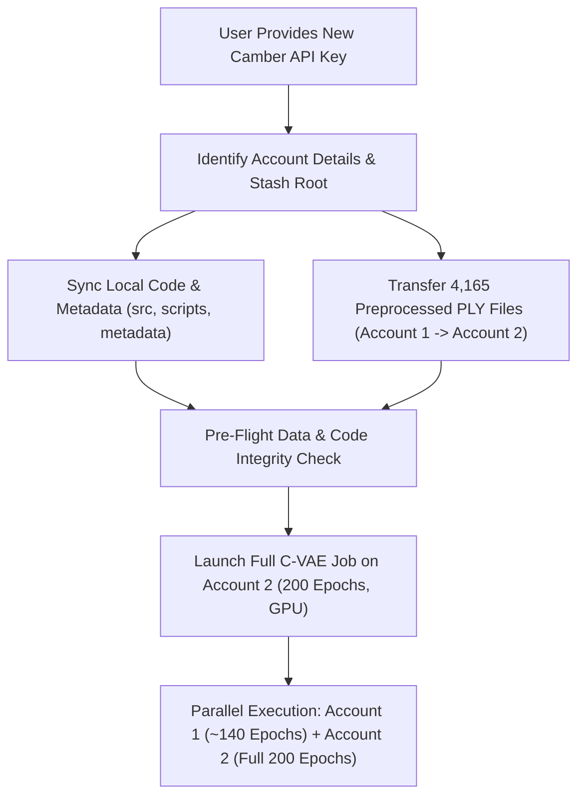

# Execution Plan: New Camber Account Stash Setup & Full C-VAE Training Run

This plan outlines the end-to-end workflow for provisioning a fresh Camber cloud account, transferring the complete code and preprocessed dataset, and launching the full 200-epoch Conditional Triplane VAE (C-VAE) training run using its untouched 5-hour GPU quota.

---

## 1. High-Level Objectives

1. **Stash Initialization**: Initialize the new account's Stash storage (`stash://<new_username>/aerodesign`) with the exact directory tree required for training.
2. **Local Code & Metadata Sync**: Sync all model architectures, datasets, and execution scripts from the local workspace to the new Stash.
3. **Cross-Account Dataset Transfer**: Transfer all 4,165 preprocessed hybrid point clouds (2,048 points each, ~400 MB) from Account 1 (`stash://adityabehera28502187/aerodesign/`) into Account 2.
4. **Pre-Flight Verification**: Validate that all 4,165 `.ply` files and metadata CSVs are in place.
5. **Launch 200-Epoch Training Run**: Start the GPU training job (`XSMALL`, CUDA enabled) on Account 2 and monitor initialization.



---

## 2. Detailed Step-by-Step Workflow

### Step 1: Account Authentication & Target Stash Identification
* Export and verify the new API key:
  ```bash
  export NEW_CAMBER_API_KEY="<user_provided_key>"
  camber job list --output json
  ```
* Resolve the target Stash URI (typically `stash://<username>/aerodesign`).
* Ensure required root directories exist:
  * `src/`
  * `scripts/`
  * `metadata/`
  * `models/`
  * `data/processed/pointclouds/`

---

### Step 2: Sync Local Codebase & Configuration
Sync all local project components to the new Stash using `camber stash cp`:
* **Source Code**: `src/` (including `src/models/triplane.py`, `src/models/vae.py`, `src/dataset.py`, `src/sampling.py`)
* **Execution Scripts**: `scripts/` (including `scripts/train_cloud.sh`, `scripts/train_triplane.py`, `scripts/evaluate_regressor_cloud.sh`)
* **Metadata & Index Files**: `metadata/` (contains vehicle metadata CSVs, shape class labels `F/E/N`, splits)
* **Environment & Dependencies**: `requirements_cloud.txt` and `.env`

---

### Step 3: Cross-Account Dataset Transfer
The 4,165 preprocessed 2,048-point hybrid `.ply` files (~400 MB total) reside in Account 1 (`stash://adityabehera28502187/aerodesign/data/processed/pointclouds/`).

We will transfer them directly into Account 2 using the most efficient bridge:
* **Option A (Direct CLI Stash Copy)**: If Camber CLI supports direct cross-authenticated transfer:
  ```bash
  # Download / stream from Account 1 -> Upload to Account 2
  ```
* **Option B (Fast Stash Bridge Transfer)**: Run a lightweight CPU container or batch download to local/scratch bridge and upload directly to Account 2's stash:
  ```bash
  # Step 3.1: Download pointclouds archive from Account 1
  # Step 3.2: Upload pointclouds archive to Account 2
  ```
* Verify that all 4,165 files are accounted for in Account 2's `data/processed/pointclouds/`.

---

### Step 4: Pre-Flight Integrity Verification
Before spending any GPU time, verify the setup:
1. **File Count Check**:
   * Confirm exactly 4,165 `.ply` files exist in `stash://<new_username>/aerodesign/data/processed/pointclouds/`.
2. **Point Cloud Format Check**:
   * Verify that sampled meshes are 2,048 vertices with 3D coordinates and normals $(x, y, z, n_x, n_y, n_z)$.
3. **Metadata Check**:
   * Verify `metadata/` contains the necessary CSV mapping files for class conditional indices (`0: F`, `1: E`, `2: N`).
4. **Script Permissions**:
   * Ensure `scripts/train_cloud.sh` is executable.

---

### Step 5: Launch & Monitor C-VAE Training Job
1. **Submit Cloud GPU Job**:
   ```bash
   camber job create \
       --engine base \
       --size xsmall \
       --gpu \
       --path stash://<new_username>/aerodesign \
       --cmd "bash scripts/train_cloud.sh"
   ```
2. **Record Job ID** and log the start timestamp.
3. **Non-Intrusive Health Check**:
   * Inspect container startup and ensure dependencies install cleanly.
   * Verify output confirms:
     ```text
     Using device: CUDA
     Loading datasets...
     Starting C-VAE training loop...
     ```
4. **Autonomous Training**:
   * Job runs for full 200 epochs (~4.5 to 4.8 hours).
   * Generates `models/triplane_vae_best.pth` and `metadata/triplane_cvae_loss_curves.png`.

---

## 3. Parallel Strategy: Account 1 vs. Account 2

| Feature | Account 1 (Job 26505) | Account 2 (New Job) |
| :--- | :--- | :--- |
| **GPU Allowance Left** | ~3.38 hours | **Full 5.0 hours** |
| **Expected Epochs** | ~135 – 145 epochs | **Full 200 epochs** |
| **Status** | Active (`RUNNING`) | Ready to initialize & launch |
| **Role** | Intermediate backup model checkpoint | Primary finished model & evaluation |
| **Risk** | May halt near quota limit | Zero risk; completes cleanly |

---

## 4. Next Action Required
To begin execution of **Step 1**, please provide:
1. The **New Camber API Key**.
2. The **New Account Username / Stash Name** (if available, otherwise we will inspect it via CLI).
