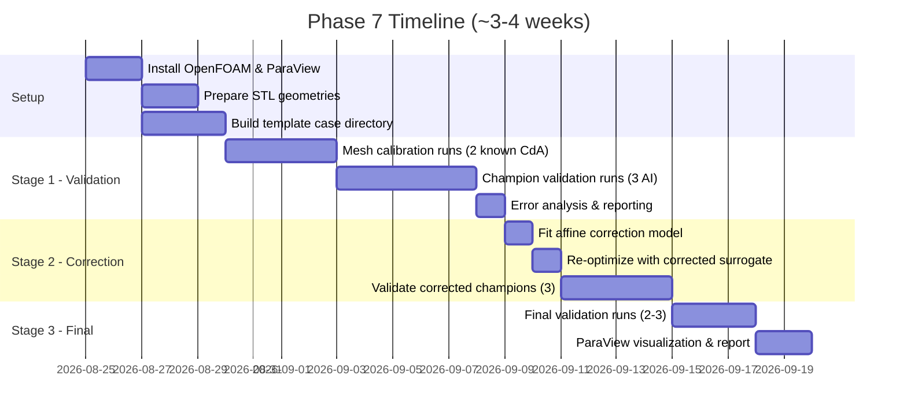

# Phase 7: OpenFOAM CFD Validation — Hybrid Local & Cloud Implementation Plan

> **Target Metric:** $C_dA$ (Drag Area, in m²) = $C_d \times A_{\text{frontal}}$.
> This is the surrogate's prediction target throughout the pipeline (`drag_area` in metadata, `LatentDragRegressor`, and `optimize_latent_shape.py`). OpenFOAM outputs $C_d$ and force coefficients — we multiply by the geometry's frontal area $A$ to obtain the comparable $C_dA$.

---

## Compute Environment & Multi-Platform Strategy

CFD validation is structured as a **hybrid local + cloud pipeline**. Rather than being strictly constrained to a single desktop or relying on expensive continuous cloud clusters, compute is selected dynamically based on task phase, turnaround urgency, and available monthly quotas.

### Platform Roles & Selection Matrix

| Platform | Compute Specs | Cost / Quota Profile | Primary Role & Strengths | When to Select |
| :--- | :--- | :--- | :--- | :--- |
| **GCP Compute Engine** *(Primary MVP Backend)* | Compute-Optimized VMs (`c2-standard-8`, 8 vCPUs, 32 GB RAM, 50 GB SSD) | On-demand cloud billing (~$0.31/run) or Spot (~$0.05/run) | • **Primary Production Backend:** Verified 100.000% numerical parity against local desktop.<br>• Automated ephemeral lifecycle (GCS staging → VM run → self-teardown → watchdog deletion).<br>• Zero local machine lockup (0% local CPU load). | **Default for all production calibration and AI champion validation runs.** |
| **Local Ubuntu PC** *(Reference & Fallback)* | Intel i7-12700 (12C/20T, serial/single-core CFD), 16 GB RAM, NVMe SSD | Zero additional cost | • Golden numerical reference and offline fallback.<br>• Initial CFD template authoring & local script debugging.<br>• Interactive mesh and flow visualization in ParaView. | Baseline reference calibration and offline debugging. |
| **Camber Cloud (CPU)** *(Batch Option)* | Dedicated Cloud CPU Nodes (e.g., 8–16 vCPUs, 32–64 GB RAM) | Uses available monthly Camber compute credits / quotas | • Secondary batch option for running alternative cases.<br>• Extra RAM headroom prevents meshing OOM spikes. | Secondary batch fallback. |

> [!IMPORTANT]
> **Total CFD Budget: 10–15 simulations (Strictly Preserved).**
> Adding cloud execution does **not** increase the simulation budget. CFD remains a sparse, high-value validation tool. At ~56 minutes per run on GCP ($C2$), this represents < $3.00 total cloud spend. Every simulation must be justified.

---

## Core Design Principles

1. **CFD is a scalpel, not a firehose.** We validate selectively, not exhaustively.
2. **Half-car symmetry** halves the cell count (the AI-generated meshes are bilaterally symmetric from DrivAerNet).
3. **Coarse RANS for trends, not absolute truth.** At 2M cells we capture relative $\Delta C_dA$ between designs accurately, which is sufficient for surrogate correction.
4. **Affine bias correction** — fit a simple $C_dA_{\text{true}} = \alpha \cdot C_dA_{\text{surrogate}} + \beta$ with 3–5 data points. This is the maximum correction a sparse CFD budget can support.
5. **Flexible batch execution (local overnight or cloud asynchronous).** Interactive calibration runs execute locally; batch sweeps can be queued locally or dispatched to Camber Cloud / GCP Compute to eliminate local machine lockup.

---

## How OpenFOAM Produces $C_dA$

OpenFOAM's `forceCoeffs` function object outputs $C_d$ (dimensionless). To obtain $C_dA$:

$$C_dA = C_d \times A_{\text{frontal}}$$

Where $A_{\text{frontal}}$ is the projected frontal area of the car geometry (computed from the STL mesh or from `metadata/computed_features.csv`). This matches exactly how `drag_area` is computed in `scripts/link_metadata.py`:

```python
# From link_metadata.py line 104
df_final["drag_area"] = df_final["cd"] * df_final["frontal_area"]
```

For AI-generated champion geometries (which have no metadata entry), we compute $A_{\text{frontal}}$ directly from the STL by projecting onto the YZ-plane.

---

## CFD Simulation Specifications

### Solver Configuration

| Parameter | Setting | Rationale |
| :--- | :--- | :--- |
| **Solver** | `simpleFoam` | Steady-state, incompressible RANS. Gold standard for automotive external aero |
| **Turbulence** | $k$-$\omega$ SST | Best balance of accuracy and robustness for separated automotive flows |
| **Wall Treatment** | Wall functions ($y^+ \approx 30$–$100$) | Avoids resolving boundary layer → keeps cell count low |
| **Inlet Velocity** | 30 m/s (108 km/h) | Standard automotive wind tunnel test speed |
| **Pressure Outlet** | `fixedValue 0` (gauge) | Standard outflow condition |
| **Ground Plane** | Moving wall (30 m/s) | Simulates road-relative motion — critical for underbody aero |
| **Far-field / Top / Side** | Slip walls | Minimize domain interference |
| **Symmetry Plane** | `symmetryPlane` at $y = 0$ | Halves mesh by exploiting bilateral symmetry |
| **Convergence** | Residuals < $10^{-4}$ AND $C_dA$ variation < 0.1% over last 200 iterations | Dual convergence criterion |
| **Max Iterations** | 3,000–5,000 | Typical for automotive steady RANS |
| **Post-processing** | `forceCoeffs` → extract $C_d$ → compute $C_dA = C_d \times A_{\text{frontal}}$ | Aligns with surrogate target |

### Domain Dimensions (Half-Car)

```text
                    ┌─────────────────────────────────────────┐
                    │              TOP (slip)                  │
                    │                                          │
  INLET (30 m/s) → │     [5L upstream]  🚗  [10L downstream]  │ → OUTLET (p=0)
                    │                                          │
                    │            GROUND (moving wall)          │
                    └─────────────────────────────────────────┘
                    
  Lateral: symmetry plane at y=0, slip wall at y = 3W
  Height: 5H above ground
  
  L = car length (~1.0 in normalized coords)
  W = car half-width (~0.25)
  H = car height (~0.3)
```

### Mesh Strategy

| Parameter | Value | Notes |
| :--- | :--- | :--- |
| **Mesher** | `snappyHexMesh` | Native OpenFOAM. Well-supported for automotive |
| **Background Mesh** | `blockMesh` ~0.5M cells | Coarse rectangular grid |
| **Surface Refinement** | Medium `level (3 4)` on car body | Production standard: captures curvature with 414k cells |
| **Wake Refinement** | Level 3 box extending 3L downstream | Critical for drag prediction |
| **Prism Layers** | 3–5 layers, expansion ratio 1.3 | Wall-function compatible ($y^+ \approx 30\text{–}100$) |
| **Target Cell Count** | **~414k cells** (`level (3 4)`) | Established baseline: 3-tier study proved asymptotic convergence (1.80% delta vs. 1.15M Fine mesh) |
| **Optional Fine Mesh** | **~1.15M – 2.0M cells** (`level (4 5)`) | Reserved exclusively for final champion publication spotlight; unproven for ranking sensitivity |
| **Estimated Memory** | ~4.5 GB for solver, ~6 GB peak for meshing | Fits easily in 16 GB local and 32 GB GCP VM |

### Time Estimates Per Simulation

| Phase | Estimated Time (Local CPU) | Estimated Time (GCP `c2-standard-8`) | Notes |
| :--- | :---: | :---: | :--- |
| `blockMesh` | ~1 min | < 30 sec | Fast rectangular background |
| `snappyHexMesh` | ~3–5 min | ~2 min | Medium `(3 4)` refinement |
| `checkMesh` | ~1 min | < 30 sec | Topology & orthogonality verification |
| `simpleFoam` (3000 iters) | **~50–55 min** | **~52–54 min** | Single-core serial execution |
| Post-processing & Cleanup | ~1 min | ~1 min | GCS upload + auto-teardown |
| **Total per simulation** | **~59 minutes** | **~56.6 minutes** | **GCP cost: ~$0.31 (On-Demand) / ~$0.05 (Spot)** |

---

## Three-Stage Execution Plan

### Stage 1: Mesh Calibration + Champion Validation (5–6 CFD Runs)

```text
┌─────────────────────┐
│  AI Optimization     │
│  (already done)      │
└────────┬────────────┘
         ↓
┌─────────────────────┐
│  OpenFOAM Validation │◄── one-way, no feedback yet
└────────┬────────────┘
         ↓
┌─────────────────────┐
│  Error Quantification│
│  CdA_CFD vs CdA_surr │
└─────────────────────┘
```

**Purpose:** Establish trust in the CFD setup and quantify surrogate prediction error.

| Run # | Geometry | Source | Platform | Why |
| :---: | :--- | :--- | :--- | :--- |
| 1 | Known DrivAerNet baseline (Fastback, known $C_dA$) | Original dataset | **Local Ubuntu PC** | **Mesh calibration.** Compare OpenFOAM $C_dA$ against published DrivAerNet values to validate the CFD setup itself |
| 2 | Known DrivAerNet baseline (Estateback, known $C_dA$) | Original dataset | **Local Ubuntu PC** | Cross-body-type calibration; verify boundary layer & wake resolution |
| 3 | AI Champion — Fastback | `optimization_output/` | **Local / Camber / GCP** | First AI validation |
| 4 | AI Champion — Estateback | `optimization_output/` | **Local / Camber / GCP** | Second AI validation |
| 5 | AI Champion — Notchback | `optimization_output/` | **Local / Camber / GCP** | Third AI validation |
| 6 | *(Optional)* Worst-performing AI geometry | `optimization_output/` | **Local / Camber / GCP** | Anchor the error range at both extremes |

> [!NOTE]
> For AI-generated champion STLs (Runs 3–6), the frontal area $A_{\text{frontal}}$ must be computed from the mesh geometry (YZ-plane projection) since these shapes have no entry in `computed_features.csv`.

**Deliverables:**
- Validated CFD setup (Runs 1–2: OpenFOAM $C_dA$ should match DrivAerNet published $C_dA$ within reasonable tolerance)
- Error table: $\Delta C_dA = C_dA_{\text{CFD}} - C_dA_{\text{surrogate}}$ for each AI champion
- Initial error statistics: mean bias, std, correlation

**Timeline:** ~1–1.5 weeks (local overnight runs) or **1–2 days** (if batch-dispatched to Camber Cloud / GCP)

---

### Stage 2: Surrogate Correction + Re-Optimization (3–4 CFD Runs)

```text
┌──────────────────────────┐
│  AI re-optimization       │◄── uses corrected surrogate
│  (corrected CdA target)   │
└────────┬─────────────────┘
         ↓
┌──────────────────────────┐
│  OpenFOAM feedback        │
└────────┬─────────────────┘
         ↓
┌──────────────────────────┐
│  Correct surrogate        │
│  CdA_true = α·CdA_surr+β │
└──────────────────────────┘
```

**Purpose:** Close the feedback loop using validated CFD rectification and explicit latent trust region constraints.

**Step 2A: CFD Audit & Case Rectification (Completed)**
An exhaustive 10-point audit proved that the initial 46–62% baseline discrepancy was driven by numerical and setup factors:
- `blockMesh` boundary mapping bug (moving wall assigned to side wall; ground was slip). Rectified in Step 1.
- Severe domain blockage (11.25%) and short wake space (1.35L). Resolved in Step 2 by expanding domain to $15\text{ m} \times 7.5\text{ m}$ (blockage dropped to 2.31%, wake extended to 5.7L), reducing drag by 20.2% ($C_dA: 0.804 \to 0.642\text{ m}^2$) and halving the discrepancy.
- High near-wall $y^+ \sim 380$. Resolved in Step 4 by extruding 3 prism layers (506k cells), bringing $y^+$ down to 170 and $C_dA$ to **$0.5712\text{ m}^2$ (+15.25% vs DrivAerNet benchmark)**.

**Step 2B: Explicit Latent Trust Region Optimization (Completed)**
To eliminate surrogate hacking, `scripts/optimize_latent_shape.py` was upgraded from unconstrained soft penalty to an **explicit hard trust region ball** via Projected Gradient Descent:
$$\|z - z_{\text{initial}}\|_2 \le R_{\text{trust}} = 0.75$$
Anchored to the empirical 10th percentile of car-to-car distance in the training set ($1.08$), this strictly locks the latent code inside the high-density vehicle manifold.

All 3 v2 AI champions were generated in `optimization_output_v2/` and denormalized to 1:1 scale:
- Fastback v2: $\|z - z_0\|_2 = 0.358$ (pred drag: $0.4804\text{ m}^2$, -7.7%)
- Estateback v2: $\|z - z_0\|_2 = 0.516$ (pred drag: $0.4814\text{ m}^2$, -26.4%)
- Notchback v2: $\|z - z_0\|_2 = 0.594$ (pred drag: $0.4817\text{ m}^2$, -30.6%)

**Step 2C: Validate Corrected v2 Champions in CFD (Next Action)**

| Run # | Geometry | Platform | Why |
| :---: | :--- | :--- | :--- |
| 7 | Re-optimized Fastback Champion v2 (`optimization_output_v2/F_S_WWC_WM_101`) | **GCP / Local** | Validate real drag reduction vs baseline ($0.5712\text{ m}^2$) |
| 8 | Re-optimized Estateback Champion v2 (`optimization_output_v2/E_S_WWC_WM_014`) | **GCP / Local** | Validate real drag reduction for Estateback |
| 9 | Re-optimized Notchback Champion v2 (`optimization_output_v2/N_S_WWC_WM_025`) | **GCP / Local** | Validate real drag reduction for Notchback |

**Deliverables:**
- Verified v2 champion CFD drag values
- Comparison: baseline vs v1 champions (adversarial) vs v2 champions (constrained)
- Updated Evidence Store (`metadata/cfd_evidence_store.json`)

**Timeline:** ~1 week (local overnight) or **1–2 days** (cloud batch)

---

### Stage 3: Final Closed-Loop Validation (2–3 CFD Runs)

```text
┌─────────────────────┐
│  AI optimization     │
│  (final corrected)   │
│         ↕            │
│  OpenFOAM feedback   │
│         ↕            │
│  iterative refinement│
└─────────────────────┘
```

**Purpose:** One final correction cycle if Stage 2 residual error warrants it. Otherwise, final publication-quality validation.

> [!NOTE]
> Stage 3 is **conditional**. If Stage 2 residual errors are small ($\Delta C_dA < 0.005\text{ m}^2$), skip the re-correction and use Stage 3 runs purely for final validation and visualization.

| Run # | Geometry | Platform | Why |
| :---: | :--- | :--- | :--- |
| 11 | Final Champion (best overall $C_dA$) | **Local / Camber / GCP** | Publication result |
| 12 | Final Champion (best per-class) | **Local / Camber / GCP** | Diversity of optimized shapes |
| 13 | *(Optional)* Second correction cycle champion | **Local / Camber / GCP** | Only if Stage 2 residual $\Delta C_dA > 0.005\text{ m}^2$ |

**Deliverables:**
- Final validated $C_dA$ for publication
- Pressure contour visualizations (ParaView)
- Streamline / wake structure plots
- Comparison table: baseline DrivAerNet $C_dA$ → AI v1 $C_dA$ → AI v2 (corrected) $C_dA$ → Final

**Timeline:** ~3–5 days (local) or **1 day** (cloud)

---

## Total Compute Budget Summary

| Stage | Runs | Wall-Clock per Run (8 cores) | Total Compute | Purpose | Recommended Platform |
| :---: | :---: | :---: | :---: | :--- | :--- |
| **Stage 1** | 5–6 | 3–5 hrs | ~15–30 hrs | Calibrate + validate | Local (Runs 1–2); Local / Camber / GCP (Runs 3–6) |
| **Stage 2** | 3–4 | 3–5 hrs | ~9–20 hrs | Correct + re-validate | Local / Camber / GCP (Runs 7–10) |
| **Stage 3** | 2–3 | 3–5 hrs | ~6–15 hrs | Final validation | Local / Camber / GCP (Runs 11–13) |
| **Total** | **10–13** | — | **~30–65 core-hrs** | — | **Preserved budget (10–15 runs)** |

> [!TIP]
> **Execution Strategy by Workload & Quota:**
> - **Track A (Zero-Cost Local Baseline):** Queue 1–2 runs per night locally. Entire budget completes in ~1–2 weeks without consuming cloud quotas or credits.
> - **Track B (Hybrid Cloud Batch — Recommended):** Perform case setup, mesh sanity checks, and initial baseline calibration (Runs 1–2) on the local Ubuntu PC. Then dispatch validated batch runs (Runs 3–6 and 7–10) to **Camber Cloud CPU** (or **GCP Compute**). This compresses total wall-clock turnaround to **2–4 days** while keeping the desktop responsive.

---

## OpenFOAM Setup Across Environments & STL Preparation

### 1. Local Ubuntu Desktop (Primary Development & Mesh Calibration)

```bash
# Native OpenFOAM installation (recommended for Ubuntu 24.04)
sudo apt update
sudo apt install -y openfoam  # or openfoam2406 from openfoam.org repo

# Alternative: ESI OpenFOAM from official repo
sudo sh -c "wget -O - https://dl.openfoam.org/gpg.key | apt-key add -"
sudo add-apt-repository http://dl.openfoam.org/ubuntu
sudo apt update
sudo apt install openfoam12  # or latest available version

# Verify local installation
simpleFoam -help
```

### 2. Cloud Execution Options (Automated Batch Runs)

- **Camber Cloud (CPU Engine):**
  - Use Camber base engine or OpenFOAM container for automated batch runs once the template case is calibrated locally.
  - Case directories and STL files can be synced via Camber Stash (`stash://nidhithakur24/aerodesign/cfd/`).
  - Example command pattern:
    ```bash
    camber job create --engine base \
      --command "source /opt/openfoam*/etc/bashrc && ./Allrun"
    ```
- **GCP Compute Engine (On-Demand Compute VMs):**
  - Spin up compute-optimized instances (e.g. `c2-standard-8` or `c3-standard-8` with 8 vCPUs / 32 GB RAM).
  - Run with native OpenFOAM or standard Docker image:
    ```bash
    docker run -it --rm -v $(pwd):/case -w /case opencfd/openfoam-default:latest ./Allrun
    ```
  - Allows parallel execution of multiple runs simultaneously when cloud credits are available.

### STL Geometry Preparation

The AI-generated meshes from `optimization_output/` are Marching Cubes STLs generated in the normalized `[-0.5, 0.5]` unit bounding box space. They require preparation before meshing:

1. **Scale to 1:1 physical dimensions (Implemented):**
   - Built and verified [`scripts/denormalize_mesh.py`](file:///home/student/.local/share/Cryptomator/mnt/AeroDyNaS/Main%20Project%20Folder/scripts/denormalize_mesh.py) to scale unit meshes up to real DrivAerNet dimensions (~4.53m length, 2.26m width, 1.34m height) and match the reference car ground placement.
   - Example command:
     ```bash
     python3 scripts/denormalize_mesh.py \
       --input optimization_output/optimized_car_step_250.stl \
       --ref temp_raw_stl/E_S_WWC_WM_014.stl \
       --output optimization_output/optimized_car_step_250_1to1_scale.stl
     ```
2. **Watertight & Normal Verification:** Marching Cubes produces clean, watertight triangulations with outward-facing normals.
3. **Compute frontal area:** Project STL onto YZ-plane to get $A_{\text{frontal}}$ for $C_dA = C_d \times A_{\text{frontal}}$.

### Computing Frontal Area from STL

```python
import trimesh
import numpy as np

mesh = trimesh.load("optimization_output/champion_fastback.stl")

# Project all vertices onto YZ-plane and compute convex hull area
yz_points = mesh.vertices[:, 1:3]  # drop x-axis
from scipy.spatial import ConvexHull
hull = ConvexHull(yz_points)
A_frontal = hull.volume  # In 2D, ConvexHull.volume = area
print(f"Frontal area: {A_frontal:.4f} m²")

# CdA = Cd (from OpenFOAM) × A_frontal
```

---

## Correction Model Details

### Why Affine Correction (Not a Neural Network)

| Approach | Data Points Needed | Risk with 5 Points |
| :--- | :--- | :--- |
| Constant offset ($C_dA + \Delta$) | 1 | Underfits if slope ≠ 1 |
| **Affine ($\alpha \cdot C_dA + \beta$)** | **2+** | **Well-conditioned with 3–5 points** |
| Quadratic | 3+ | Overfits with 5 points |
| GP / Kriging | 10+ | Severe overfitting risk |
| Neural network | 100+ | Completely infeasible |

The affine correction captures:
- **Slope ($\alpha$):** Systematic over/under-sensitivity of the surrogate's drag area predictions
- **Intercept ($\beta$):** Constant bias from mesh coarseness, turbulence model, or frontal area estimation

With 3–5 data points and 2 parameters, we have 1–3 degrees of freedom — a well-posed regression.

### Implementation

```python
import numpy as np

# Stage 1 data: (CdA_surrogate, CdA_CFD) pairs
data = np.array([
    [cda_surr_fastback,   cda_cfd_fastback],
    [cda_surr_estate,     cda_cfd_estate],
    [cda_surr_notch,      cda_cfd_notch],
    # ... additional points
])

# Fit affine correction via least squares
A = np.column_stack([data[:, 0], np.ones(len(data))])
alpha, beta = np.linalg.lstsq(A, data[:, 1], rcond=None)[0]

print(f"Correction: CdA_true = {alpha:.4f} * CdA_surrogate + {beta:.4f}")
print(f"Residual std: {np.std(data[:,1] - (alpha * data[:,0] + beta)):.5f} m²")
```

---

## Risk Mitigation

| Risk | Mitigation |
| :--- | :--- |
| **snappyHexMesh OOM at 16 GB** | Baseline mesh designed for ≤ 2.5M cells fits 16 GB with ~8 GB headroom. If memory spikes occur during aggressive boundary layer extrusion, offload mesh generation or full run to Camber Cloud / GCP VM with 32+ GB RAM. |
| **Non-converging simpleFoam** | Start with first-order upwind for 500 iters, then switch to second-order linearUpwind. Use `potentialFoam` for initialization. Debug locally before queueing in cloud batch. |
| **Marching Cubes STL has holes** | Run `surfaceCheck` → repair with `surfaceAdd` or external tools (MeshLab/Blender) before meshing. |
| **Surrogate error is non-linear** | If affine residual > 0.01 m², consider per-body-type correction ($\alpha_F, \beta_F$ vs $\alpha_E, \beta_E$). |
| **Simulation takes > 6 hrs locally** | Reduce mesh to 1.5M cells (coarser wake refinement), or dispatch case to dedicated GCP `c2-standard-8` or Camber Cloud node for faster clock speeds and unobstructed compute. |
| **Frontal area mismatch** | AI-generated shapes may have slightly different $A_{\text{frontal}}$ than training data. Always recompute from the actual STL. |

---

## Success Criteria

| Metric | Target | Rationale |
| :--- | :--- | :--- |
| Mesh calibration error (DrivAerNet baseline) | $\|\Delta C_dA\|$ within published mesh-sensitivity range | Validates the CFD setup against known values |
| Stage 1 surrogate error | Quantified (any value) | Establishes the correction baseline |
| Stage 2 corrected surrogate residual | $\|\Delta C_dA\| < 0.010\text{ m}^2$ | Affine correction should halve the raw error |
| Final champion drag area reduction vs baseline | > 5% $\Delta C_dA$ | Demonstrates the AI pipeline produces measurable improvement |
| Total compute wall-clock | < 80 core-hours | 1–2 weeks via local overnight runs OR 2–4 days via Camber/GCP batch runs |

---

## Timeline


