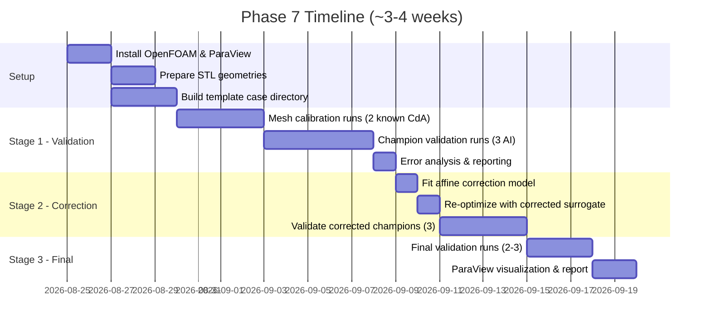

# Phase 7: OpenFOAM CFD Validation — Desktop-Constrained Implementation Plan

> **Target Metric:** $C_dA$ (Drag Area, in m²) = $C_d \times A_{\text{frontal}}$.
> This is the surrogate's prediction target throughout the pipeline (`drag_area` in metadata, `LatentDragRegressor`, and `optimize_latent_shape.py`). OpenFOAM outputs $C_d$ and force coefficients — we multiply by the geometry's frontal area $A$ to obtain the comparable $C_dA$.

---

## Hardware Reality Check

| Resource | Available | Implication |
| :--- | :--- | :--- |
| **CPU** | Intel i7-12700 (8P + 4E = 12 cores / 20 threads) | Can dedicate **8–10 cores** to OpenFOAM while keeping the machine responsive |
| **RAM** | 16 GB | Hard ceiling: **~5–6M cells max** (rule of thumb: ~2–2.5 GB per 1M cells + OS overhead). Practical target: **≤ 3M cells** |
| **GPU** | Intel UHD 770 (integrated) | No CUDA. OpenFOAM is CPU-based, so this is fine for CFD. No GPU-accelerated meshing |
| **Storage** | 512 GB SSD | Each OpenFOAM case ≈ 1–3 GB. Budget ~30–50 GB for all cases. Comfortable |
| **OS** | Ubuntu 24.04 LTS | Native OpenFOAM support via APT. Best-case scenario |

> [!IMPORTANT]
> **Total CFD Budget: 10–15 simulations.**
> At ~2–4 hours per run on 8 cores, this represents ~20–60 hours of compute — roughly **1–2 weeks of overnight runs**. Every simulation must be justified.

---

## Core Design Principles

1. **CFD is a scalpel, not a firehose.** We validate selectively, not exhaustively.
2. **Half-car symmetry** halves the cell count (the AI-generated meshes are bilaterally symmetric from DrivAerNet).
3. **Coarse RANS for trends, not absolute truth.** At 2M cells we capture relative $\Delta C_dA$ between designs accurately, which is sufficient for surrogate correction.
4. **Affine bias correction** — fit a simple $C_dA_{\text{true}} = \alpha \cdot C_dA_{\text{surrogate}} + \beta$ with 3–5 data points. This is the maximum correction a sparse CFD budget can support.
5. **Overnight batch execution.** Queue runs to execute while the machine is idle.

---

## How OpenFOAM Produces $C_dA$

OpenFOAM's `forceCoeffs` function object outputs $C_d$ (dimensionless). To obtain $C_dA$:

$$C_dA = C_d \times A_{\text{frontal}}$$

Where $A_{\text{frontal}}$ is the projected frontal area of the car geometry (computed from the STL mesh or from `metadata/computed_features.csv`). This matches exactly how `drag_area` is computed in `scripts/link_metadata.py`:

```python
# From link_metadata.py line 104
df_final["drag_area"] = df_final["cd"] * df_final["frontal_area"]
```

For AI-generated champion geometries (which have no metadata entry), we compute $A_{\text{frontal}}$ directly from the STL by projecting onto the YZ-plane.

---

## CFD Simulation Specifications

### Solver Configuration

| Parameter | Setting | Rationale |
| :--- | :--- | :--- |
| **Solver** | `simpleFoam` | Steady-state, incompressible RANS. Gold standard for automotive external aero |
| **Turbulence** | $k$-$\omega$ SST | Best balance of accuracy and robustness for separated automotive flows |
| **Wall Treatment** | Wall functions ($y^+ \approx 30$–$100$) | Avoids resolving boundary layer → keeps cell count low |
| **Inlet Velocity** | 30 m/s (108 km/h) | Standard automotive wind tunnel test speed |
| **Pressure Outlet** | `fixedValue 0` (gauge) | Standard outflow condition |
| **Ground Plane** | Moving wall (30 m/s) | Simulates road-relative motion — critical for underbody aero |
| **Far-field / Top / Side** | Slip walls | Minimize domain interference |
| **Symmetry Plane** | `symmetryPlane` at $y = 0$ | Halves mesh by exploiting bilateral symmetry |
| **Convergence** | Residuals < $10^{-4}$ AND $C_dA$ variation < 0.1% over last 200 iterations | Dual convergence criterion |
| **Max Iterations** | 3,000–5,000 | Typical for automotive steady RANS |
| **Post-processing** | `forceCoeffs` → extract $C_d$ → compute $C_dA = C_d \times A_{\text{frontal}}$ | Aligns with surrogate target |

### Domain Dimensions (Half-Car)

```text
                    ┌─────────────────────────────────────────┐
                    │              TOP (slip)                  │
                    │                                          │
  INLET (30 m/s) → │     [5L upstream]  🚗  [10L downstream]  │ → OUTLET (p=0)
                    │                                          │
                    │            GROUND (moving wall)          │
                    └─────────────────────────────────────────┘
                    
  Lateral: symmetry plane at y=0, slip wall at y = 3W
  Height: 5H above ground
  
  L = car length (~1.0 in normalized coords)
  W = car half-width (~0.25)
  H = car height (~0.3)
```

### Mesh Strategy

| Parameter | Value | Notes |
| :--- | :--- | :--- |
| **Mesher** | `snappyHexMesh` | Native OpenFOAM. Well-supported for automotive |
| **Background Mesh** | `blockMesh` ~0.5M cells | Coarse rectangular grid |
| **Surface Refinement** | Level 4–5 on car body | Captures curvature |
| **Wake Refinement** | Level 3 box extending 3L downstream | Critical for drag prediction |
| **Prism Layers** | 3–5 layers, expansion ratio 1.3 | Wall-function compatible |
| **Target Cell Count** | **~2M cells** (half-car) | ≡ ~4M full-car equivalent. Fits in 16 GB with ~8–10 GB headroom |
| **Estimated Memory** | ~4–5 GB for solver, ~6–8 GB peak for meshing | Leaves room for OS |

### Time Estimates Per Simulation

| Phase | Estimated Time | Cores |
| :--- | :--- | :--- |
| `blockMesh` | ~1 min | 1 |
| `snappyHexMesh` | 20–40 min | 8 |
| `decomposePar` | 2–5 min | 1 |
| `simpleFoam` (3000 iters) | **2–4 hours** | 8 |
| Post-processing (`forceCoeffs` → $C_dA$) | 5 min | 1 |
| **Total per simulation** | **~3–5 hours** | — |

---

## Three-Stage Execution Plan

### Stage 1: Mesh Calibration + Champion Validation (5–6 CFD Runs)

```text
┌─────────────────────┐
│  AI Optimization     │
│  (already done)      │
└────────┬────────────┘
         ↓
┌─────────────────────┐
│  OpenFOAM Validation │◄── one-way, no feedback yet
└────────┬────────────┘
         ↓
┌─────────────────────┐
│  Error Quantification│
│  CdA_CFD vs CdA_surr │
└─────────────────────┘
```

**Purpose:** Establish trust in the CFD setup and quantify surrogate prediction error.

| Run # | Geometry | Source | Why |
| :---: | :--- | :--- | :--- |
| 1 | Known DrivAerNet baseline (Fastback, known $C_dA$) | Original dataset | **Mesh calibration.** Compare OpenFOAM $C_dA$ against published DrivAerNet values to validate the CFD setup itself |
| 2 | Known DrivAerNet baseline (Estateback, known $C_dA$) | Original dataset | Cross-body-type calibration |
| 3 | AI Champion — Fastback | `optimization_output/` | First AI validation |
| 4 | AI Champion — Estateback | `optimization_output/` | Second AI validation |
| 5 | AI Champion — Notchback | `optimization_output/` | Third AI validation |
| 6 | *(Optional)* Worst-performing AI geometry | `optimization_output/` | Anchor the error range at both extremes |

> [!NOTE]
> For AI-generated champion STLs (Runs 3–6), the frontal area $A_{\text{frontal}}$ must be computed from the mesh geometry (YZ-plane projection) since these shapes have no entry in `computed_features.csv`.

**Deliverables:**
- Validated CFD setup (Runs 1–2: OpenFOAM $C_dA$ should match DrivAerNet published $C_dA$ within reasonable tolerance)
- Error table: $\Delta C_dA = C_dA_{\text{CFD}} - C_dA_{\text{surrogate}}$ for each AI champion
- Initial error statistics: mean bias, std, correlation

**Timeline:** ~1.5 weeks (run overnight, post-process during the day)

---

### Stage 2: Surrogate Correction + Re-Optimization (3–4 CFD Runs)

```text
┌──────────────────────────┐
│  AI re-optimization       │◄── uses corrected surrogate
│  (corrected CdA target)   │
└────────┬─────────────────┘
         ↓
┌──────────────────────────┐
│  OpenFOAM feedback        │
└────────┬─────────────────┘
         ↓
┌──────────────────────────┐
│  Correct surrogate        │
│  CdA_true = α·CdA_surr+β │
└──────────────────────────┘
```

**Purpose:** Close the feedback loop once using sparse CFD data.

**Step 2A: Fit Affine Correction Model**

Using Stage 1 data points (3–5 pairs of $(C_dA_{\text{surrogate}}, C_dA_{\text{CFD}})$):

$$C_dA_{\text{corrected}} = \alpha \cdot C_dA_{\text{surrogate}} + \beta$$

This is the most statistically robust correction possible with $O(5)$ data points. More complex models (GP, neural net) would overfit.

**Step 2B: Re-Optimize with Corrected Surrogate**

Modify `optimize_latent_shape.py` to apply the affine correction during gradient descent:

```python
# In the optimization loop
drag_area_predicted = regressor(z)                                     # raw surrogate (normalized)
drag_area_corrected = alpha * drag_area_predicted + beta               # bias-corrected
loss = drag_area_corrected + lambda_reg * torch.norm(z)**2             # minimize corrected drag area
```

This is a one-line change. The gradient flows through the affine transform unchanged (just scales by α).

**Step 2C: Validate Corrected Champions**

| Run # | Geometry | Why |
| :---: | :--- | :--- |
| 7 | Re-optimized Fastback Champion v2 | Validate correction for Fastback |
| 8 | Re-optimized Estateback Champion v2 | Validate correction for Estateback |
| 9 | Re-optimized Notchback Champion v2 | Validate correction for Notchback |
| 10 | *(Optional)* Interpolated latent geometry | Test generalization of correction |

**Deliverables:**
- Corrected surrogate parameters ($\alpha$, $\beta$) with residual error
- Comparison: v1 champions vs v2 champions ($C_dA$ improvement after correction)
- Updated error statistics

**Timeline:** ~1 week

---

### Stage 3: Final Closed-Loop Validation (2–3 CFD Runs)

```text
┌─────────────────────┐
│  AI optimization     │
│  (final corrected)   │
│         ↕            │
│  OpenFOAM feedback   │
│         ↕            │
│  iterative refinement│
└─────────────────────┘
```

**Purpose:** One final correction cycle if Stage 2 residual error warrants it. Otherwise, final publication-quality validation.

> [!NOTE]
> Stage 3 is **conditional**. If Stage 2 residual errors are small ($\Delta C_dA < 0.005\text{ m}^2$), skip the re-correction and use Stage 3 runs purely for final validation and visualization.

| Run # | Geometry | Why |
| :---: | :--- | :--- |
| 11 | Final Champion (best overall $C_dA$) | Publication result |
| 12 | Final Champion (best per-class) | Diversity of optimized shapes |
| 13 | *(Optional)* Second correction cycle champion | Only if Stage 2 residual $\Delta C_dA > 0.005\text{ m}^2$ |

**Deliverables:**
- Final validated $C_dA$ for publication
- Pressure contour visualizations (ParaView)
- Streamline / wake structure plots
- Comparison table: baseline DrivAerNet $C_dA$ → AI v1 $C_dA$ → AI v2 (corrected) $C_dA$ → Final

**Timeline:** ~3–5 days

---

## Total Compute Budget Summary

| Stage | Runs | Wall-Clock per Run | Total Time | Purpose |
| :---: | :---: | :---: | :---: | :--- |
| **Stage 1** | 5–6 | 3–5 hrs | ~15–30 hrs | Calibrate + validate |
| **Stage 2** | 3–4 | 3–5 hrs | ~9–20 hrs | Correct + re-validate |
| **Stage 3** | 2–3 | 3–5 hrs | ~6–15 hrs | Final validation |
| **Total** | **10–13** | — | **~30–65 hrs** | **~1–2 weeks of overnight runs** |

> [!TIP]
> **Overnight batch strategy:** Queue 2 runs per night (each ~4 hours). At 2 runs/night, 13 runs complete in ~7 business days.

---

## OpenFOAM Installation & STL Preparation

### Installation (Ubuntu 24.04)

```bash
# Native OpenFOAM installation (recommended for Ubuntu 24.04)
sudo apt update
sudo apt install -y openfoam  # or openfoam2406 from openfoam.org repo

# Alternative: ESI OpenFOAM from official repo
sudo sh -c "wget -O - https://dl.openfoam.org/gpg.key | apt-key add -"
sudo add-apt-repository http://dl.openfoam.org/ubuntu
sudo apt update
sudo apt install openfoam12  # or latest available version

# Verify
simpleFoam -help
```

### STL Geometry Preparation

The AI-generated meshes from `optimization_output/` are Marching Cubes STLs. They need preparation:

1. **Scale to physical dimensions:** The meshes are normalized to unit bounding box. Scale to real DrivAerNet dimensions (~4.6m length for Fastback).
2. **Repair mesh defects:** Marching Cubes can produce non-manifold edges. Run through `surfaceCheck` and `surfaceConvert`.
3. **Orient normals outward:** Required for `snappyHexMesh` to determine inside/outside.
4. **Position on ground plane:** Place the car on $z = 0$ with front at $x = 0$.
5. **Compute frontal area:** Project STL onto YZ-plane to get $A_{\text{frontal}}$ for $C_dA = C_d \times A_{\text{frontal}}$.

```bash
# OpenFOAM surface utilities
surfaceCheck car_champion.stl        # Validate topology
surfaceOrient car_champion.stl car_oriented.stl "(0 0 1)"  # Orient normals
surfaceTransformPoints -translate '(-0.5 0 0)' car_oriented.stl car_positioned.stl
```

### Computing Frontal Area from STL

```python
import trimesh
import numpy as np

mesh = trimesh.load("optimization_output/champion_fastback.stl")

# Project all vertices onto YZ-plane and compute convex hull area
yz_points = mesh.vertices[:, 1:3]  # drop x-axis
from scipy.spatial import ConvexHull
hull = ConvexHull(yz_points)
A_frontal = hull.volume  # In 2D, ConvexHull.volume = area
print(f"Frontal area: {A_frontal:.4f} m²")

# CdA = Cd (from OpenFOAM) × A_frontal
```

---

## Correction Model Details

### Why Affine Correction (Not a Neural Network)

| Approach | Data Points Needed | Risk with 5 Points |
| :--- | :--- | :--- |
| Constant offset ($C_dA + \Delta$) | 1 | Underfits if slope ≠ 1 |
| **Affine ($\alpha \cdot C_dA + \beta$)** | **2+** | **Well-conditioned with 3–5 points** |
| Quadratic | 3+ | Overfits with 5 points |
| GP / Kriging | 10+ | Severe overfitting risk |
| Neural network | 100+ | Completely infeasible |

The affine correction captures:
- **Slope ($\alpha$):** Systematic over/under-sensitivity of the surrogate's drag area predictions
- **Intercept ($\beta$):** Constant bias from mesh coarseness, turbulence model, or frontal area estimation

With 3–5 data points and 2 parameters, we have 1–3 degrees of freedom — a well-posed regression.

### Implementation

```python
import numpy as np

# Stage 1 data: (CdA_surrogate, CdA_CFD) pairs
data = np.array([
    [cda_surr_fastback,   cda_cfd_fastback],
    [cda_surr_estate,     cda_cfd_estate],
    [cda_surr_notch,      cda_cfd_notch],
    # ... additional points
])

# Fit affine correction via least squares
A = np.column_stack([data[:, 0], np.ones(len(data))])
alpha, beta = np.linalg.lstsq(A, data[:, 1], rcond=None)[0]

print(f"Correction: CdA_true = {alpha:.4f} * CdA_surrogate + {beta:.4f}")
print(f"Residual std: {np.std(data[:,1] - (alpha * data[:,0] + beta)):.5f} m²")
```

---

## Risk Mitigation

| Risk | Mitigation |
| :--- | :--- |
| **snappyHexMesh OOM** at 16 GB | Use `distributedTriSurfaceMesh` for parallel meshing; limit refinement levels; target ≤ 2.5M cells |
| **Non-converging simpleFoam** | Start with first-order upwind for 500 iters, then switch to second-order linearUpwind. Use `potentialFoam` for initialization |
| **Marching Cubes STL has holes** | Run `surfaceCheck` → repair with `surfaceAdd` or external tools (MeshLab/Blender) before meshing |
| **Surrogate error is non-linear** | If affine residual > 0.01 m², consider per-body-type correction ($\alpha_F, \beta_F$ vs $\alpha_E, \beta_E$) |
| **Simulation takes > 6 hrs** | Reduce mesh to 1.5M cells. Coarser wake refinement. Acceptable accuracy trade-off for trend analysis |
| **Frontal area mismatch** | AI-generated shapes may have slightly different $A_{\text{frontal}}$ than training data. Always recompute from the actual STL |

---

## Success Criteria

| Metric | Target | Rationale |
| :--- | :--- | :--- |
| Mesh calibration error (DrivAerNet baseline) | $\|\Delta C_dA\|$ within published mesh-sensitivity range | Validates the CFD setup against known values |
| Stage 1 surrogate error | Quantified (any value) | Establishes the correction baseline |
| Stage 2 corrected surrogate residual | $\|\Delta C_dA\| < 0.010\text{ m}^2$ | Affine correction should halve the raw error |
| Final champion drag area reduction vs baseline | > 5% $\Delta C_dA$ | Demonstrates the AI pipeline produces measurable improvement |
| Total compute wall-clock | < 80 hours | Fits within 2–3 weeks of overnight runs |

---

## Timeline


