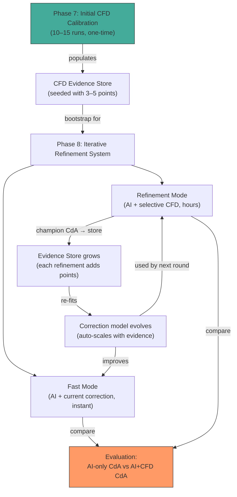

# Phase 8: Iterative AI–CFD Closed-Loop Refinement Plan

> **Project Novelty:** *"Integrate CFD simulations with AI models to iteratively refine designs."*
> Phase 8 makes this claim real. The system selectively invokes OpenFOAM on champion candidates, accumulates physics evidence to evolve the surrogate correction, and re-optimizes — forming a genuine iterative refinement loop.

---

## Relationship to Phase 7

Phase 7 produces 10–15 initial CFD runs that calibrate the system, quantify surrogate error, and seed the CFD evidence store. Phase 8 builds on that foundation:

- **Phase 7** = one-time bootstrap (populates the evidence store, fits the initial correction)
- **Phase 8** = the living system (accumulates evidence, evolves the correction, enables on-demand physics refinement)

Phase 7's affine calibration (α, β) is **not discarded** — it is the first entry in the evidence store. But it is not the permanent end state.

---

## Hardware Constraint (Unchanged)

| Resource | Available |
| :--- | :--- |
| **CPU** | Intel i7-12700 (12C/20T) |
| **RAM** | 16 GB |
| **GPU** | Intel UHD 770 (integrated — no CUDA) |
| **OS** | Ubuntu 24.04 LTS |

> [!IMPORTANT]
> CFD must remain **sparse and resource-bounded** at all times. No HPC, no cloud compute for CFD. Every OpenFOAM run costs ~3–5 hours on 8 cores.

---

## Core Architecture: Two Operational Modes

```text
┌─────────────────────────────────────────────────────────────────────┐
│                        USER INPUT                                   │
│              car_mesh.stl  +  body_type ("Fastback")                │
└──────────────────────────┬──────────────────────────────────────────┘
                           │
                    ┌──────▼──────┐
                    │  Mode Select │
                    └──┬───────┬──┘
                       │       │
            ┌──────────▼──┐  ┌─▼──────────────┐
            │  FAST MODE   │  │ REFINEMENT MODE │
            │  (AI-only)   │  │ (AI + CFD loop) │
            └──────┬───────┘  └───────┬─────────┘
                   │                  │
                   ▼                  ▼
            ┌────────────┐    ┌─────────────────────────────┐
            │ Surrogate   │    │  AI optimizes → champion     │
            │ + current   │    │         ↓                    │
            │ correction  │    │  Select champion for CFD     │
            │ (instant)   │    │  (not every candidate)       │
            │             │    │         ↓                    │
            │ Output:     │    │  OpenFOAM evaluates champion │
            │ optimized   │    │         ↓                    │
            │ mesh + CdA  │    │  CFD result → evidence store │
            └─────────────┘    │         ↓                    │
                               │  Update correction model     │
                               │         ↓                    │
                               │  Re-optimize with updated    │
                               │  surrogate                   │
                               │         ↓                    │
                               │  Check budget cap            │
                               │         ↓                    │
                               │  Output: refined mesh + CdA  │
                               └─────────────────────────────┘
```

### Fast Mode (Default)

- **CFD involvement:** None.
- **Correction used:** Whatever correction model the evidence store currently supports (could be identity if no evidence, affine after Phase 7, or richer model after multiple refinement sessions).
- **Speed:** Seconds to minutes.
- **Use case:** Rapid exploration, generating many candidate shapes.

### Physics-Refinement Mode (On-Demand)

- **CFD involvement:** Selective — only the final champion from each optimization round gets evaluated by OpenFOAM. Intermediate optimization steps are **never** sent to CFD.
- **Speed:** Hours per refinement round (3–5 hrs per CFD run on desktop hardware).
- **Use case:** When the user wants physics-validated results, or when the surrogate is operating in an untested region of the design space.

> [!IMPORTANT]
> **CFD is never run on every candidate.** The optimizer evaluates thousands of latent vectors via the surrogate during gradient descent. Only the converged champion geometry of each refinement round is selected for OpenFOAM evaluation. This is what makes the loop viable on desktop hardware.

---

## Refinement Loop — One Round

```text
Round N:
  1. Run optimize_latent_shape.py with current correction model → champion z_N*
  2. Decode z_N* → champion_roundN.stl
  3. Run OpenFOAM on champion_roundN.stl → CdA_cfd_N
  4. Record (z_N*, CdA_surrogate(z_N*), CdA_cfd_N, body_type) → evidence store
  5. Re-fit correction model from ALL accumulated evidence
  6. Check: budget cap reached? → stop
  7. Otherwise → Round N+1 (re-optimize with updated correction)
```

### Parameters Determined Empirically from Phase 7

The following parameters are **intentionally left unspecified** in this plan. They will be determined during Phase 7 execution, based on observed CFD cost, surrogate error magnitude, improvement per round, and convergence behavior:

- Number of refinement rounds per session
- Convergence threshold (latent space distance, CdA improvement delta)
- When diminishing returns make additional rounds wasteful
- Whether stopping should be adaptive or fixed

Phase 8 code will expose these as **configurable parameters** with sensible defaults that can be updated after Phase 7 produces real data.

### Configurable Hard Budget Caps

The system enforces safety bounds so it cannot run indefinitely:

```
--max_rounds N          # Hard cap on refinement iterations
--max_cfd_hours H       # Total wall-clock budget for CFD in this session
```

These are **safety bounds**, not optimization targets. The actual stopping behavior (convergence, diminishing returns) will be parameterized separately after Phase 7.

---

## Evolving Surrogate Correction

The correction model is **not** part of the neural network — it is a separate, lightweight layer that sits on top of the frozen regressor. It evolves as CFD evidence accumulates.

### Why Not Fixed α, β

A single global affine correction only captures the bias observed in the specific shapes tested during Phase 7. As the system encounters new shapes (different latent regions, different body types), the correction may be inadequate.

### Correction Model Tiers

| Evidence Count | Correction Strategy | Notes |
|---|---|---|
| 0 | Identity (no correction) | Pre-Phase 7 |
| 1–2 | Constant offset | Underdetermined for slope |
| 3–5 | Global affine (α·x + β) | Phase 7 bootstrap |
| 6–15 | Per-body-type affine | Separate (α, β) per Fastback/Estateback/Notchback |
| 15+ | Local correction (k-NN residual or lightweight GP) | Region-specific, non-linear |

The correction auto-selects its tier based on evidence count and must remain **differentiable** for gradient-based optimization:

- Affine: trivially differentiable
- Per-class affine: differentiable (piecewise linear by class)
- k-NN weighted residual: differentiable w.r.t. surrogate input (weights fixed given latent vector)

---

## CFD Evidence Store

The persistent data structure that accumulates all CFD results — from Phase 7 calibration and from every subsequent refinement session.

### Storage Format (JSON)

```json
{
    "evidence": [
        {
            "id": "phase7_fastback_001",
            "source": "phase7_stage1",
            "body_type": "Fastback",
            "latent_vector_path": "cfd_evidence/latents/fb_001.npy",
            "stl_path": "cfd_evidence/stls/fb_001.stl",
            "cda_surrogate": 0.312,
            "cda_cfd": 0.328,
            "frontal_area": 2.15,
            "timestamp": "2026-09-01T22:30:00"
        }
    ]
}
```

### Key Operations

- `add_evidence(...)` — Append a new CFD data point
- `fit_correction()` — Re-fit correction model from all evidence (auto-selects tier)
- `predict_corrected(cda_surr, body_type, latent_vec)` — Apply current correction
- `get_evidence_count(body_type=None)` — Count of CFD points
- `nearest_evidence_distance(latent_vec)` — L2 distance to nearest validated point

---

## Success Evaluation: AI-Only vs AI+CFD

Phase 8's value is measured by comparing the two modes head-to-head using CFD-validated CdA as ground truth.

| Metric | AI-Only (Fast Mode) | AI+CFD (Refinement Mode) |
|---|---|---|
| Optimized shape CdA (surrogate) | Recorded | Recorded |
| Optimized shape CdA (**CFD-validated**) | Requires a validation run | Produced as part of the loop |
| Wall-clock time | Seconds | Hours |
| Surrogate-CFD gap | Quantified | Should decrease with refinement |

**Key question:** Does AI+CFD refinement produce meaningfully lower CdA (CFD-validated) compared to AI-only? If yes, by how much, and at what compute cost?

This comparison is the primary evidence for the project's novelty claim.

---

## Implementation: New Files

| File | Purpose |
|---|---|
| `src/cfd_evidence_store.py` | Persistent store for all CFD evidence (Phase 7 + refinement sessions) |
| `src/surrogate_correction.py` | Tiered, differentiable correction layer that evolves with evidence |
| `scripts/refine_with_cfd.py` | Refinement mode orchestrator (AI → CFD → update → re-optimize loop) |
| `scripts/openfoam_runner.py` | Automates single-geometry OpenFOAM execution and result extraction |

### Integration with Existing Code

**`scripts/optimize_latent_shape.py`** — Minimal modification to support the correction layer:

```python
# Current:
pred_drag = regressor(z_opt, class_idx=class_idx)
loss = pred_drag_clamped + args.lambda_reg * similarity_penalty

# Modified:
pred_drag = regressor(z_opt, class_idx=class_idx)
pred_drag_corrected = correction_model.correct(pred_drag, body_type, z_opt)
loss = pred_drag_corrected_clamped + args.lambda_reg * similarity_penalty
```

New argument: `--evidence_store path/to/evidence.json` (optional; omit for raw surrogate, backward compatible).

---

## Phase 7 → Phase 8 Flow



---

## Open Design Decisions

These will be resolved during or after Phase 7:

1. **Refinement trigger:** User-initiated or system-suggested (e.g., "this latent vector is far from validated regions")?
2. **CFD automation level:** Fully automated (script runs OpenFOAM end-to-end) or semi-automated (script prepares case, user launches, script parses)?
3. **Evidence persistence format:** Simple JSON file or versioned store with correction model snapshots?
4. **Stopping strategy details:** Fixed round count, adaptive convergence, or hybrid — informed by Phase 7 empirical results.
