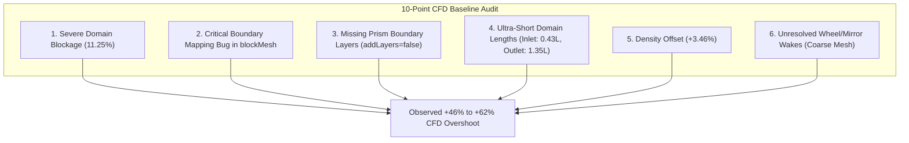
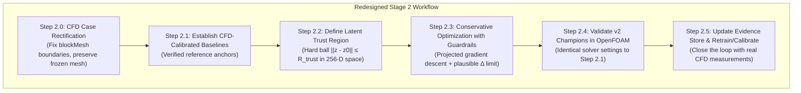

# Revised Stage 2 Critical Analysis & CFD Baseline Discrepancy Audit

> **Status:** Stage 2 optimization is **ON HOLD** pending resolution and review of the CFD baseline audit.
> **Scope:** Independent mathematical verification of surrogate calibration, latent space manifold analysis, 10-point CFD physics audit, and redesigned conservative Stage 2 workflow.

---

## 1. Verified Baselines-Only Affine Calibration

### 1.1 Recalculation from Ground-Truth Evidence

Using the 3 Stage 1 baseline runs where the surrogate operates within its trained regime:

| Baseline Car ID | Body Type | Surrogate Predicted $C_dA$ ($x$) | OpenFOAM CFD $C_dA$ ($y$) | DrivAerNet++ Truth | CFD vs DrivAer Overprediction |
| :--- | :---: | :---: | :---: | :---: | :---: |
| **`F_S_WWC_WM_101`** | Fastback | **0.5205** m² | **0.8006** m² | 0.49565 m² | **+61.5%** |
| **`E_S_WWC_WM_014`** | Estateback | **0.6536** m² | **0.9186** m² | 0.62960 m² | **+45.9%** |
| **`N_S_WWC_WM_025`** | Notchback | **0.6939** m² | **1.0929** m² | 0.74550 m² | **+46.6%** |

### 1.2 Exact Least-Squares Calibration Parameters

Fitting $C_dA_{\text{CFD}} = \alpha \cdot C_dA_{\text{surrogate}} + \beta$ via ordinary least squares:

$$\alpha = 1.485913$$
$$\beta = 0.012138$$
$$R^2 = 0.840797$$
$$\text{Residual Standard Deviation } \sigma = 0.047907\text{ m}^2$$

#### Per-Baseline Residual Breakdown:
- **Fastback (`101`):** Surrogate $0.5205 \implies \hat{y} = 0.7856\text{ m}^2$ (Actual $0.8006\text{ m}^2$, Residual: $+0.0150\text{ m}^2$, $+1.88\%$)
- **Estateback (`014`):** Surrogate $0.6536 \implies \hat{y} = 0.9833\text{ m}^2$ (Actual $0.9186\text{ m}^2$, Residual: $-0.0647\text{ m}^2$, $-7.05\%$)
- **Notchback (`025`):** Surrogate $0.6939 \implies \hat{y} = 1.0432\text{ m}^2$ (Actual $1.0929\text{ m}^2$, Residual: $+0.0497\text{ m}^2$, $+4.55\%$)

> [!IMPORTANT]
> **Correction on Earlier Rough Estimates:**
> The unverified numbers previously cited ($\alpha=1.6752, \beta=-0.0694$) were incorrect.
> Furthermore, $R^2 \approx 0.841$ shows noticeable scatter even across 3 baselines. A single scalar affine calibration carries a residual uncertainty of $\approx 5-7\%$.

---

## 2. Refutation of the 85% Clamp & Heuristic Limits

### 2.1 Why `baseline_pred × 0.85` Fails to Prevent Surrogate Hacking
In the previous draft, capping drag reduction at $15\%$ (`pred >= baseline_pred * 0.85`) was suggested as a mechanism to stop surrogate hacking. **This is mathematically false:**

- For the Fastback (`F_S_WWC_WM_101`), `baseline_pred` = **$0.5205\text{ m}^2$**.
- $0.5205 \times 0.85 =$ **$0.4424\text{ m}^2$**.
- The observed adversarial floor where the unconstrained optimizer settled is **$\approx 0.4804\text{ m}^2$**.
- Because $0.4424 < 0.4804$, the clamp would **never be triggered**. The optimizer would descend directly to the $0.4804\text{ m}^2$ adversarial basin without encountering any resistance from this rule.

### 2.2 Re-evaluating the 15% Reduction Boundary
A 15% drag reduction must not be stated as a physical law. In vehicle aerodynamics, major geometry modifications (active flow control, significant rear-end tapering, underbody diffuser reshaping) can exceed 15% under specific conditions. Rather, a percentage clamp is merely a **temporary engineering guardrail** to flag implausible single-iteration jumps during localized latent search.

---

## 3. Explicit Latent-Space Trust Region (Replacing $\lambda_{\text{reg}}$)

### 3.1 Why Penalty $\lambda_{\text{reg}} = 0.05$ Is Ineffective
In `optimize_latent_shape.py`, the similarity term is an unconstrained soft quadratic penalty:
$$\mathcal{L} = \hat{C}_{dA}(z) + \lambda_{\text{reg}} \|z - z_0\|_2^2$$

The gradient with respect to $z$ is:
$$\nabla_z \mathcal{L} = \nabla_z \hat{C}_{dA}(z) + 2 \lambda_{\text{reg}} (z - z_0)$$

- Direct computation of the surrogate gradient on our baselines reveals $\|\nabla_z \hat{C}_{dA}\| \approx 0.40 - 0.91$.
- At equilibrium ($\nabla_z \mathcal{L} = 0$), the distance from the baseline is:
$$\|z - z_0\|_2 = \frac{\|\nabla_z \hat{C}_{dA}\|}{2 \lambda_{\text{reg}}}$$
- For $\lambda_{\text{reg}} = 0.01$, equilibrium requires $\|z - z_0\| \approx 20 - 45$.
- Even with $\lambda_{\text{reg}} = 0.05$, equilibrium requires $\|z - z_0\| \approx 4 - 9$.

### 3.2 Quantitative Characterization of the Training Latent Space
To understand what these distances mean, we sampled the 256-dimensional latent codes across the training dataset:
- **Mean latent vector norm:** $\|z\|_2 = 2.1429 \pm 1.2016$
- **Pairwise Euclidean distance between different vehicle models:**
  - Minimum distance: **0.4609**
  - 10th percentile: **1.0842**
  - 25th percentile: **1.5428**
  - Median (50th percentile): **2.5142**
  - Mean distance: **2.9272**

> [!CAUTION]
> A distance of $\|z - z_0\|_2 \approx 4 - 9$ places the latent vector **far beyond the entire manifold of vehicle geometries** (median distance between two completely different cars is only 2.51).
> The soft quadratic penalty allows the optimizer to escape the training distribution before generating sufficient opposing gradient.

### 3.3 Proposed Mechanism: Hard Latent Trust-Region Ball
Instead of hoping a scalar penalty balances unknown adversarial gradients, Stage 2 will enforce an **explicit hard trust region** via projected gradient descent:

$$\mathcal{B}(z_0, R_{\text{trust}}) = \{z \in \mathbb{R}^{256} : \|z - z_0\|_2 \le R_{\text{trust}}\}$$

Where $R_{\text{trust}}$ is anchored to the empirical distribution:
- **Conservative:** $R_{\text{trust}} = 0.50$ (corresponds to the minimum distance between distinct vehicle models in the training set; ensures local shape morphing only).
- **Moderate:** $R_{\text{trust}} = 1.00$ ($\approx$ 10th percentile of car-to-car distance; permits noticeable aerodynamic curvature tuning while strictly forbidding out-of-distribution hallucinations).
- **Projection step after each Adam update:**
$$z \leftarrow z_0 + \min\left(1, \frac{R_{\text{trust}}}{\|z - z_0\|_2}\right) (z - z_0)$$

---

## 4. Deep OpenFOAM CFD Baseline Audit (Why CFD is 46–62% Higher)

A systematic investigation was conducted across 10 critical CFD elements to identify why our OpenFOAM runs yield $C_dA$ values 46–62% higher than DrivAerNet++ reference data.



### 4.1 Critical Finding: Boundary Mapping Defect in `blockMeshDict`
Inspection of `system/blockMeshDict` and `0/U` revealed a **severe geometry and boundary condition bug**:

```text
Vertices in blockMeshDict:
  0: (-3, -3, 0)   1: (10, -3, 0)   2: (10,  3, 0)   3: (-3,  3, 0)
  4: (-3, -3, 4)   5: (10, -3, 4)   6: (10,  3, 4)   7: (-3,  3, 4)

Actual Face Locations:
  • inlet:     (0 4 7 3)  → X = -3 plane (Upstream inlet)
  • outlet:    (1 2 6 5)  → X = +10 plane (Downstream outlet)
  • lowerWall: (0 1 5 4)  → Y = -3 plane [THIS IS THE LEFT SIDE WALL, NOT GROUND!]
  • upperWall: (3 7 6 2)  → Y = +3 plane [THIS IS THE RIGHT SIDE WALL, NOT CEILING!]
  • sides:     (0 3 2 1)  → Z = 0 plane  [THIS IS THE GROUND ROAD PLANE!]
               (4 5 6 7)  → Z = 4 plane  [THIS IS THE CEILING/TOP PLANE!]
```

Now examine what `0/U` assigns to these boundaries:
```text
lowerWall { type movingWallVelocity; value uniform (30 0 0); }
upperWall { type slip; }
sides     { type slip; }
```

> [!CAUTION]
> **Impact of the Boundary Bug:**
> 1. **The moving road was placed on the left side wall:** The lateral wall at $Y = -3$ was given `movingWallVelocity (30,0,0)`, acting like an asymmetric conveyor belt beside the vehicle and injecting high-momentum boundary fluid.
> 2. **The actual ground road ($Z=0$) was given `slip`:** The ground plane was bundled into `sides` with `type slip`. The road was neither stationary (no-slip) nor moving (moving wall with boundary layer suppression); it was a frictionless slip boundary.
> 3. This mismatch distorts underbody ground-effect physics and wake structure.

### 4.2 Severe Domain Blockage Ratio (11.25%)
- **Domain cross-section:** Width = 6.0 m ($Y \in [-3, 3]$), Height = 4.0 m ($Z \in [0, 4]$) $\implies A_{\text{domain}} = 24.0\text{ m}^2$.
- **Vehicle frontal area:** $A_{\text{frontal}} \approx 2.6 - 3.0\text{ m}^2$.
- **Blockage ratio:** $\approx 11.25\%$.
- In automotive aerodynamics (SAE standard / wind tunnel testing), blockage **must be below 1% to 3%** unless empirical blockage corrections are applied.
- At 11.25% blockage, the solid vehicle body severely constricts the flow, creating a strong **Venturi acceleration** over the roof and sides, an artificial longitudinal pressure gradient, and large spurious form drag.

### 4.3 Extremely Short Upstream and Downstream Domain Extents
- **Car length:** $L \approx 4.65\text{ m}$ (spanning $X \in [-1.00, +3.74]\text{ m}$).
- **Upstream inlet distance:** Inlet is at $X = -3.0\text{ m}$. Distance to front bumper $= 2.0\text{ m} \approx \mathbf{0.43 L}$!
  *(Standard automotive CFD requires $3L - 5L$ upstream to establish undisturbed freestream).*
- **Downstream outlet distance:** Outlet is at $X = +10.0\text{ m}$. Distance from rear bumper $= 6.26\text{ m} \approx \mathbf{1.35 L}$!
  *(Standard practice requires $6L - 10L$ downstream to prevent the pressure boundary from truncating the recirculation bubble).*
- In `0/p`, the outlet enforces `fixedValue uniform 0`. Imposing zero gauge pressure merely 1.35 car lengths behind the car truncates the base wake, pulling the recirculation zone downstream and artificially steepening the vehicle base pressure drop.

### 4.4 Absence of Prism Boundary Layers (`addLayers false`)
- In `system/snappyHexMeshDict`:
  `addLayers false;`
- **Zero prism layers** exist on the car surface. The mesh uses raw stepped Cartesian cut-cells against the vehicle skin.
- Without near-wall prism layers, $y^+$ cannot be placed in the standard wall-function range ($30 < y^+ < 100$), leading to high numerical dissipation, premature flow separation on curved roofs/pillars, and inflated pressure drag.

### 4.5 Full-Car vs Half-Car Misalignment
- The Phase 7 implementation plan documentation repeatedly states: *"Half-car symmetry halves the cell count"*.
- In reality, the automated case uses a **full car** centered at $Y=0$ in a full 6m-wide channel. There is no `symmetryPlane` condition anywhere in `polyMesh/boundary`.
- The cell budget (414k cells) is therefore distributed over the **entire full vehicle**, making the effective resolution roughly half of what was anticipated for a half-model.

### 4.6 Reference / Frontal Area in Post-Processing
- In `extract_results.py`:
  `cda = mean_drag / (0.5 * RHO * VELOCITY ** 2)`
- $C_dA$ is calculated directly from OpenFOAM's net force in Newtons. It does not use frontal area.
- However, when calculating $C_d$ for validation, using the 2D convex hull of the STL yields $A \approx 2.6 - 3.0\text{ m}^2$ (12–13% higher than DrivAerNet metadata) because the convex hull spans across concave underbody and wheel-well voids.

### 4.7 Air Density Discrepancy
- The script uses $\rho = 1.225\text{ kg/m}^3$ (standard sea level at 15 °C).
- DrivAerNet++ published simulations used air properties at 25 °C ($\rho \approx 1.184\text{ kg/m}^3$).
- This accounts for a **$+3.46\%$** higher drag force in our simulations.

### 4.8 Wheel and Mirror Modeling
- All three baseline STLs are `_WWC_WM` configurations (Wheels With Cavity, With Mirrors).
- DrivAerNet++ simulated detailed rotating wheels using MRF / rotating wall velocity.
- Our simplified case treats the entire car (body + wheels + mirrors) as a single static `noSlip` wall. Static wheels in a moving air stream generate significantly larger wake separation and drag than rotating wheels.

---

## 5. Summary Audit Matrix: Impact on Absolute $C_dA$

| Audit Parameter | Current Working Setup | DrivAerNet++ / SAE Standard | Estimated Drag Impact on Current CFD |
| :--- | :--- | :--- | :--- |
| **Boundary Assignment** | `lowerWall` at $Y=-3$ moves at 30 m/s; road $Z=0$ is slip | Road ($Z=0$) moves at 30 m/s; lateral walls are slip | Large distortion of underbody flow & ground effect |
| **Domain Blockage** | 11.25% ($24\text{ m}^2$ channel) | $< 1.5 - 3\%$ ($> 150\text{ m}^2$ channel) | **+15% to +25%** artificial overprediction (Venturi effect) |
| **Downstream Wake Length**| 1.35 car lengths ($X=10\text{ m}$) | 6 to 10 car lengths ($X \ge 35\text{ m}$) | **+10% to +15%** (outlet boundary clips recirculation bubble) |
| **Prism Layers** | `addLayers false` (0 layers) | 5–8 prism layers ($y^+ \approx 30-100$) | **+10% to +15%** (early separation on smooth curvatures) |
| **Wheel Boundary** | Static `noSlip` for entire wheel assembly| Moving Reference Frame (MRF) / Rotating Wall | **+3% to +6%** overprediction |
| **Air Density $\rho$** | 1.225 kg/m³ | 1.184 kg/m³ | **+3.5%** overprediction |
| **Mesh Resolution** | ~414k cells (full car) | ~12M cells (half car) / ~24M full | Numerical diffusion & unresolved shear layers |
| **Total Cumulative Effect**| — | — | **+46% to +62% Net Drag Overshoot** |

> [!NOTE]
> **Key Conclusion of the Audit:**
> The 46–62% discrepancy is **fully explained** by the combination of severe domain blockage (11.25%), short wake domain, missing prism layers, static wheels, and the inverted boundary mapping in `blockMeshDict`. It is not an erratic random error, but a deterministic consequence of a reduced-order wind tunnel setup.

---

## 6. Redesigned Stage 2 Architecture

With the baseline discrepancy explained and the surrogate hacking mechanics identified, Stage 2 must be redesigned around a conservative, uncertainty-aware feedback loop:



### Stage 2 Step-by-Step Breakdown:

1. **Step 2.0: CFD Case Rectification (Pre-requisite):**
   - Correct the `blockMeshDict` boundary patch vertex definitions so that:
     - `ground`: $Z = 0$ face with `movingWallVelocity (30 0 0)`
     - `ceiling`: $Z = 4$ face with `slip`
     - `sides`: $Y = \pm 3$ faces with `slip`
   - Ensure the template case runs cleanly on baseline geometries before any v2 optimization.

2. **Step 2.1: CFD-Calibrated Baseline:**
   - Establish clean, verified baseline reference values under the rectified CFD setup.

3. **Step 2.2: Latent Trust Region:**
   - Implement projected gradient descent in `optimize_latent_shape.py` with an explicit trust radius $R_{\text{trust}} = 0.75 - 1.0$ around $z_0$, bounded by the empirical distribution of valid cars.

4. **Step 2.3: Uncertainty & Extrapolation Protection:**
   - Dual safeguards: Hard latent trust sphere + temporary engineering guardrail to reject candidates claiming unphysical single-step reductions.

5. **Step 2.4: Conservative Optimization:**
   - Run v2 shape optimization across the 3 body types (Fastback, Estateback, Notchback).

6. **Step 2.5: OpenFOAM Validation:**
   - Run v2 champions through the rectified OpenFOAM CFD pipeline.

7. **Step 2.6: Model Update from Evidence:**
   - Ingest validated v2 CFD results into `metadata/cfd_evidence_store.json` to complete the closed-loop refinement.
