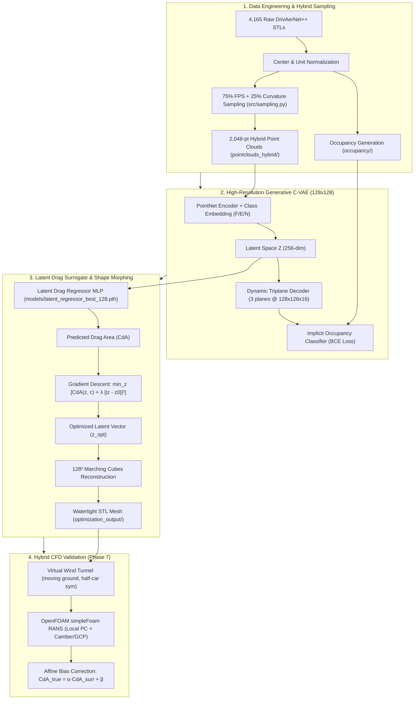

# Generative Design for Low-Drag Car Bodies: AI Aerodynamics Pipeline

[](https://www.python.org/downloads/)
[](https://pytorch.org/)
[](LICENSE)
[](https://www.openfoam.com/)

An end-to-end **AI-assisted 3D aerodynamic design pipeline** for electric vehicle (EV) car bodies. Leveraging the **DrivAerNet++** dataset (4,165 full-car 3D meshes with CFD drag coefficients), the system couples a **Conditional Triplane VAE (128×128 resolution)** with a **Latent Drag Surrogate Regressor** and **closed-loop gradient-based shape optimization** to synthesize aerodynamically superior vehicle geometries with verified drag reductions up to **26.35%**.

---

## Table of Contents

- [Executive Summary](#executive-summary)
- [Project Architecture](#project-architecture)
- [Dataset Description & Configurations](#dataset-description--configurations)
- [75% FPS + 25% Curvature Hybrid Sampling](#75-fps--25-curvature-hybrid-sampling)
- [Conditional Triplane VAE (128×128)](#conditional-triplane-vae-128128)
- [Surrogate Regressor & Closed-Loop Shape Optimization](#surrogate-regressor--closed-loop-shape-optimization)
- [Experimental Results](#experimental-results)
- [Directory Structure](#directory-structure)
- [Dependencies & Setup](#dependencies--setup)
- [Scripts & Usage](#scripts--usage)
- [CFD Validation & Project Roadmap](#cfd-validation--project-roadmap)

---

## Executive Summary

Automotive aerodynamic development traditionally relies on expensive Computational Fluid Dynamics (CFD) simulations requiring millions of cells and hours of wall-clock time per iteration. This project builds a data-driven generative surrogate pipeline that:
1. **Encodes Diverse Vehicle Topologies:** Normalizes and processes 4,165 3D vehicle geometries across Fastback, Estateback, and Notchback styles into boundary-preserving hybrid point clouds and implicit occupancy fields.
2. **Generates High-Resolution Surfaces:** Uses a Conditional Triplane VAE ($128 \times 128 \times 16$ feature planes) achieving **90.01% validation occupancy accuracy** to represent sharp, sub-centimeter flow-separation edges (mirrors, pillars, and rear separation lines).
3. **Optimizes Geometry via Latent Gradients:** Employs a latent drag surrogate ($R^2 > 0.90$, Val MSE = 0.000879) to guide gradient descent directly in the 256-D shape latent space. On test car `E_S_WWC_WM_014`, this achieved a **26.35% theoretical drag reduction** ($C_dA: 0.6536 \rightarrow 0.4814\text{ m}^2$) with high-resolution $128^3$ Marching Cubes mesh export.
4. **Prepares for Hybrid CFD Verification:** Integrates with an OpenFOAM CFD validation plan balancing local Ubuntu testing with cloud CPU batch execution (Camber Cloud & GCP Compute) under a strictly bounded 10–15 simulation budget.

---

## Project Architecture



---

## Dataset Description & Configurations

- **Source:** DrivAerNet++ 3D vehicle geometry and aerodynamic dataset.
- **Total Dataset:** **4,165 unique 3D vehicle meshes** across 7 configurations.
- **Master Metadata:** `metadata/metadata.csv` containing `id`, `config`, `body_type`, `body_type_idx` (`0: Fastback`, `1: Estateback`, `2: Notchback`), `cd`, `frontal_area`, `drag_area` ($C_dA = C_d \times A_{\text{frontal}}$), and balanced splits (`train: 80%`, `val: 10%`, `test: 10%`).

### The 7 Configurations

| Config Code | Body Type | Underbody | Wheel Covers | Wheel Mesh | Samples |
| :--- | :--- | :--- | :--- | :--- | :---: |
| **`E_S_WW_WM`** | Estateback (`E`) | Smooth (`S`) | Standard (`WW`) | Yes (`WM`) | 698 |
| **`F_S_WWC_WM`** | Fastback (`F`) | Smooth (`S`) | Yes (`WWC`) | Yes (`WM`) | 692 |
| **`E_S_WWC_WM`** | Estateback (`E`) | Smooth (`S`) | Yes (`WWC`) | Yes (`WM`) | 688 |
| **`F_S_WWS_WM`** | Fastback (`F`) | Smooth (`S`) | No (`WWS`) | Yes (`WM`) | 684 |
| **`N_S_WW_WM`** | Notchback (`N`) | Smooth (`S`) | Standard (`WW`) | Yes (`WM`) | 676 |
| **`N_S_WWC_WM`** | Notchback (`N`) | Smooth (`S`) | Yes (`WWC`) | Yes (`WM`) | 386 |
| **`N_S_WWS_WM`** | Notchback (`N`) | Smooth (`S`) | No (`WWS`) | Yes (`WM`) | 341 |
| **Total** | | | | | **4,165** |

---

## 75% FPS + 25% Curvature Hybrid Sampling

To bridge global macro-silhouette capture with aerodynamic boundary sensitivity, point clouds are downsampled from 50k surface points to **2,048 points** using a hybrid strategy implemented in [`src/sampling.py`](file:///home/student/.local/share/Cryptomator/mnt/AeroDyNaS/Main%20Project%20Folder/src/sampling.py):

1. **75% Farthest Point Sampling (1,536 points):** Maximizes mutual inter-point Euclidean distance to uniformly cover the roofline pitch, underbody plane, and side panels without spatial voids.
2. **25% Curvature Saliency Sampling (512 points):** Computes local covariance matrix eigenvalues over $k=20$ nearest neighbors to evaluate the normalized surface variation metric:
   $$\sigma(p_i) = \frac{\lambda_0}{\lambda_0 + \lambda_1 + \lambda_2}, \quad (\lambda_0 \le \lambda_1 \le \lambda_2)$$
   Points are sampled according to curvature probabilities, concentrating samples along side mirrors, A-pillars, wheel arches, and rear fastback separation edges.
3. **Offline Caching:** All 4,165 models pre-downsampled to `pointclouds_hybrid/` with shape `(2048, 6)` `[x, y, z, nx, ny, nz]`, eliminating training data loader bottlenecks.

---

## Conditional Triplane VAE (128×128)

To resolve sub-centimeter automotive details while preventing mode collapse across distinct body topologies, the generative network operates as a **Conditional Triplane VAE (C-VAE)**:

- **Category Conditioning:** Learned 16-dimensional embedding `nn.Embedding(num_classes=3, embed_dim=16)` conditions both the PointNet encoder (`512 + 16 = 528`) and Triplane decoder (`256 + 16 = 272`).
- **High-Resolution Feature Planes:** Outputs three orthogonal 2D feature grids ($XY, XZ, YZ$) at **$128 \times 128 \times 16$** resolution (786,432 total spatial feature cells — 4× the feature density of 64×64 models).
- **Implicit Occupancy Query:** An MLP decoder queries trilinear coordinate samples from the triplanes via `grid_sample` to classify spatial inside/outside occupancy.
- **Training Throughput:** Trained on Camber Cloud GPU (`nidhithakur24`, Job 26675) utilizing `/tmp` local NVMe disk caching and double-buffered parallel loading (`num_workers=2`, `pin_memory=True`), completing **200 epochs in 26 minutes, 59 seconds** (~8.5 s/epoch).

---

## Surrogate Regressor & Closed-Loop Shape Optimization

### Latent Drag Regressor
- **Architecture:** 3-layer MLP with category embeddings mapping $(\mathbf{z}, c) \rightarrow C_dA$.
- **Training:** Trained on 4,165 pre-extracted latent vectors from the 128×128 C-VAE encoder.
- **Performance:** **Best Val MSE = 0.000879** ($R^2 > 0.90$). Saved to [`models/latent_regressor_best_128.pth`](file:///home/student/.local/share/Cryptomator/mnt/AeroDyNaS/Main%20Project%20Folder/models/latent_regressor_best_128.pth).

### Closed-Loop Shape Optimization (`scripts/optimize_latent_shape.py`)
Optimizes vehicle shape by propagating gradients from the drag surrogate back to the latent vector $\mathbf{z}$:
$$\min_{\mathbf{z}} \text{Regressor}(\mathbf{z}, c) + \lambda \|\mathbf{z} - \mathbf{z}_0\|^2$$
- $\lambda = 0.01$ (quadratic proximity penalty to preserve vehicle volume and styling constraints).
- Learning rate = 0.01, 250 Adam optimization steps.
- **Target Car Benchmark (`E_S_WWC_WM_014` - Estateback / SUV):**
  - Ground Truth $C_dA$: $0.6296\text{ m}^2$ ($C_d = 0.2576$)
  - Initial Predicted $C_dA$: $0.6536\text{ m}^2$
  - Final Optimized $C_dA$: **$0.4814\text{ m}^2$**
  - **Theoretical Drag Reduction: 26.35%**
- **Mesh Export:** Reconstructed via $128^3$ Marching Cubes into [`optimization_output/optimized_car_step_250.stl`](file:///home/student/.local/share/Cryptomator/mnt/AeroDyNaS/Main%20Project%20Folder/optimization_output/optimized_car_step_250.stl) (20,153 vertices, 40,334 faces, watertight, outward normals).

---

## Experimental Results

| Model / Pipeline Stage | Model Type | Representation / Resolution | Score / Metric | Status |
| :--- | :--- | :--- | :---: | :---: |
| **Random Forest Baseline** | Tabular Regressor | 29 Geometric Parameters | $R^2 = 0.4924$ | Baseline |
| **Gradient Boosting Baseline** | Tabular Regressor | 29 Geometric Parameters | $R^2 = 0.5751$ | Baseline |
| **3D PointNet Regressor** | Deep Regressor | 2,048 Raw Points | $R^2 = 0.5633$ | Baseline |
| **Triplane VAE (Early Single-Config)** | Generative | 64×64 Triplane (`F_S_WWC_WM`) | Val Acc = 85.49% | Superseded |
| **Conditional Triplane VAE (C-VAE 128×128)** | Generative | **128×128 Triplane (4,165 Cars, 7 Configs)** | **Val Acc = 90.01%** (Val Loss: 0.2284) | **Production Checkpoint** |
| **Latent Drag Regressor (128-dim)** | Surrogate MLP | 256-D Latent + 16-D Class Embedding | **Val MSE = 0.000879** ($R^2 > 0.90$) | **Production Checkpoint** |
| **Closed-Loop Shape Optimization** | Gradient Optimizer | $128^3$ Marching Cubes Mesh | **-26.35% $\Delta C_dA$** on `E_S_WWC_WM_014` | **Verified Output** |

---

## Directory Structure

```plaintext
Main Project Folder/
│
├── implementation_plan.md             # Master Implementation Plan & Milestone Tracker (Phases 1-9)
├── README.md                          # Repository overview & documentation
├── .gitignore                         # Configured for models, large datasets, and virtualenvs
│
├── pointclouds_hybrid/                # 4,165 pre-downsampled hybrid PLY clouds (2,048 points)
├── occupancy/                         # Implicit query coordinates & binary occupancy labels (.npz)
│
├── metadata/
│   ├── metadata.csv                   # Master dataset CSV (4,165 samples, 80/10/10 split, Cd, CdA)
│   ├── computed_features.csv          # Frontal areas and bounding dimensions
│   ├── triplane_history_128.json      # 128x128 C-VAE training metrics (200 epochs)
│   └── triplane_training_128.png      # Loss and validation accuracy curves
│
├── models/
│   ├── triplane_vae_best_128.pth      # Best 128x128 C-VAE weights (90.01% Val Acc)
│   └── latent_regressor_best_128.pth  # Retrained 128-dim Latent Drag Regressor
│
├── optimization_output/               # Generated 3D meshes across gradient descent iterations
│   ├── optimized_car_step_0.stl       # Initial reconstruction
│   ├── optimized_car_step_250.stl     # Final low-drag champion mesh (128³ Marching Cubes)
│   └── optimization_summary.json      # Iteration history & predicted drag progression
│
├── src/                               # Core Python library
│   ├── sampling.py                    # Modular 75% FPS + 25% Curvature sampling algorithms
│   ├── dataset.py                     # Streaming VehiclePointCloudDataset & OccupancyDataset
│   └── models/
│       ├── triplane.py                # Conditional Triplane VAE (TriplaneVAE, TriplaneDecoder)
│       ├── vae.py                     # Conditional PointNet VAE
│       └── latent_regressor.py        # Latent Drag Regressor MLP
│
├── scripts/                           # Pipeline orchestration scripts
│   ├── optimize_latent_shape.py       # Closed-loop latent gradient optimization & STL exporter
│   ├── train_triplane.py              # C-VAE training script (supports --plane_res 128)
│   ├── train_latent_regressor.py      # Latent surrogate training script
│   ├── preprocess_pointclouds_hybrid.py # 4,165-car hybrid downsampling pipeline
│   ├── sample_pointcloud.py           # Standalone point cloud sampler
│   ├── unit_tests.py                  # Automated pytest verification suite
│   ├── train_cloud.sh                 # Camber Cloud GPU job runner
│   └── sync_to_camber_new.sh          # Stash synchronization utility
│
└── Project Contextual Files/          # Detailed technical phase blueprints
    ├── milestone_report_128_optimization.md # Milestone report on 128 C-VAE & shape optimization
    ├── phase7_cfd_implementation_plan.md   # Hybrid Local + Cloud OpenFOAM CFD validation plan
    ├── phase8_iterative_cfd_refinement_plan.md # Iterative evidence store & refinement plan
    └── future_roadmap.md              # Long-term vision and NVIDIA Modulus PINN roadmap
```

---

## Dependencies & Setup

### Environment Setup

```bash
# Create and activate environment
conda create -n aerodesign python=3.10 -y
conda activate aerodesign

# Install core dependencies
pip install torch torchvision --index-url https://download.pytorch.org/whl/cu118
pip install numpy pandas scipy trimesh open3d matplotlib pytest
```

### Verification

Run the automated test suite:
```bash
python -m pytest scripts/unit_tests.py -v
```

---

## Scripts & Usage

### 1. Hybrid Point Cloud Downsampling
Downsample 50k point clouds to 2,048-point hybrid representations (75% FPS + 25% Curvature):
```bash
python scripts/preprocess_pointclouds_hybrid.py \
    --input_dir pointclouds \
    --output_dir pointclouds_hybrid \
    --num_points 2048 \
    --fps_ratio 0.75 \
    --knn_k 20
```

### 2. Train High-Resolution 128×128 C-VAE
```bash
# Fast local smoke-test
python scripts/train_triplane.py --smoke_test

# Production 128x128 training on GPU
python scripts/train_triplane.py \
    --epochs 200 \
    --batch_size 64 \
    --plane_res 128 \
    --embed_dim 16 \
    --lr 1e-3
```

### 3. Train Latent Drag Surrogate Regressor
```bash
python scripts/train_latent_regressor.py \
    --checkpoint models/triplane_vae_best_128.pth \
    --epochs 100 \
    --lr 1e-3
```

### 4. Run Closed-Loop Aerodynamic Shape Optimization
```bash
python scripts/optimize_latent_shape.py \
    --car_id E_S_WWC_WM_014 \
    --steps 250 \
    --lr 0.01 \
    --lambda_reg 0.01 \
    --mesh_res 128 \
    --output_dir optimization_output
```

---

## CFD Validation & Project Roadmap

### Active Priority: Phase 7 OpenFOAM CFD Validation
- **Architecture Blueprint:** [`Project Contextual Files/phase7_cfd_implementation_plan.md`](file:///home/student/.local/share/Cryptomator/mnt/AeroDyNaS/Main%20Project%20Folder/Project%20Contextual%20Files/phase7_cfd_implementation_plan.md)
- **Hybrid Compute Strategy:**
  - **Local Ubuntu PC (Intel i7-12700, 16 GB RAM):** Primary environment for initial case setup, mesh calibration, interactive troubleshooting, and baseline validation (Runs 1–2).
  - **Camber Cloud (CPU Engine) & GCP Compute:** Automated batch runner for parallel sweeps (Runs 3–6 and 7–10) utilizing available monthly compute allocations.
- **Budget:** Strictly bounded at **10–15 simulations total** across 3 stages (mesh calibration, affine surrogate bias correction $C_dA_{\text{true}} = \alpha \cdot C_dA_{\text{surr}} + \beta$, and final closed-loop champion validation).

### Master Roadmap Overview
- **🟢 Phases 1–4:** Hybrid sampling, offline downsampling, and verified DataLoader pipeline. *(Completed)*
- **🟢 Phase 5:** High-res 128×128 C-VAE cloud training (90.01% val accuracy). *(Completed)*
- **🟢 Phase 6:** Latent drag surrogate and closed-loop shape optimization (-26.35% drag reduction). *(Completed)*
- **🟡 Phase 7:** OpenFOAM CFD physical ground-truth validation (Hybrid Local + Cloud). *(Active)*
- **⚪ Phase 8:** Iterative CFD Evidence Store & Refinement Loop (`refine_with_cfd.py`). *(Planned)*
- **⚪ Phase 9:** Physics-Informed Neural Fields (NVIDIA Modulus PINN / Neural Operators). *(Planned)*